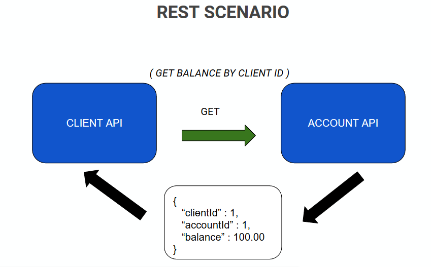
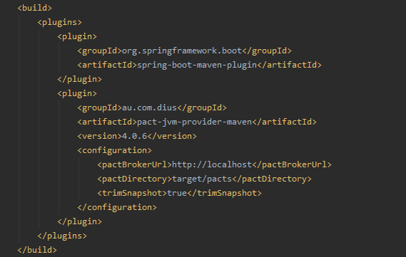

# Pact workshop with Pact JVM and Junit 5


This repository contains an example of implementation of Pact Framework in Spring Boot and Junit 5.

## Tools Used

 - OpenJdk 11
 - Spring Boot
 - Swagger
 - Pact JVM
 - Pact Broker

## Pact concept

Pact is a code-first tool for testing HTTP and message integrations using contract tests. Contract tests assert that inter-application messages conform to a shared understanding that is documented in a contract. Without contract testing, the only way to ensure that applications will work correctly together is by using expensive and brittle integration tests.
Do you set your house on fire to test your smoke alarm? No, you test the contract it holds with your ears by using the testing button. Pact provides that testing button for your code, allowing you to safely confirm that your applications will work together without having to deploy the world first.

## Scenario



I maked two rest apis called client API and Account API. The client API must call account API to get client balance. This apis have an dependence, that is an simple example to use pact framework to make Consumer Driven Contract Test

## Pact Workflow


The consumer creates and maintains a contract. Both the consumer and provider verify against that contract with every change in their code base.

The process of consumer-driven contracts looks like this:

 - The API consumer creates and maintains a contract (in agreement with the provider).

 - The API consumer verifies that it successfully runs against the contract.

 - The API consumer publishes the contract.

 - The API provider verifies that it successfully runs against the contract.

## Examples

The "integration" folder only have an integration between apis.

If you want see full example, please jump to the "example" folder. 

### Example of one consumer and one producer
On the "one_consumer_one_producer" folder, open client-api on your favorite IDE, open Test Class AccountPactTest.

#### Generating Contract

To generate contract, run junit Tests from the class AccountPactTest. After passed tests, the pact maven plugin will generate a json file from contract between client and account api.


#### Publish Contract on Pact Broker

To publish this contract to Pact Broker, open terminal on folder "infraestructure" and up Pact Broker Container.

```
docker-compose up -d
```

The Pact broker will be avaliable on http://localhost

To make client-api send contract to broker, we must have pact maven plugin configured corretly, as the same of above.



After confirm this information, open another terminal from client-api root folder and run maven goal pact publish.

```
mvn pact:publish
```

After successful published, you can see contract on pact broker url.

### Other examples

The "example" folder has other examples that can be run like the "one_consumer_one_producer" already explained. 

## Test Contract on Provider side

On the project account-api we have some tests based on client-api consumer contract. These tests are in the class "AccountProviderPactTest", you can check if its works running junit tests. Make sure your pact Broker was up when you run the tests. The concept is that the provider will obtain the contract from the boker and do tests with mocks. If your contract is ok the junit tests will be passed.

## Links

 - Documentation: <br />
https://docs.pact.io/

- PactFlow: <br />
https://pactflow.io/

 - Pact Benefits: <br />
https://pactflow.io/how-pact-works/?utm_source=ossdocs&utm_campaign=intro_animation#slide-1

- Pact Broker: <br />
https://github.com/pact-foundation/pact_broker


